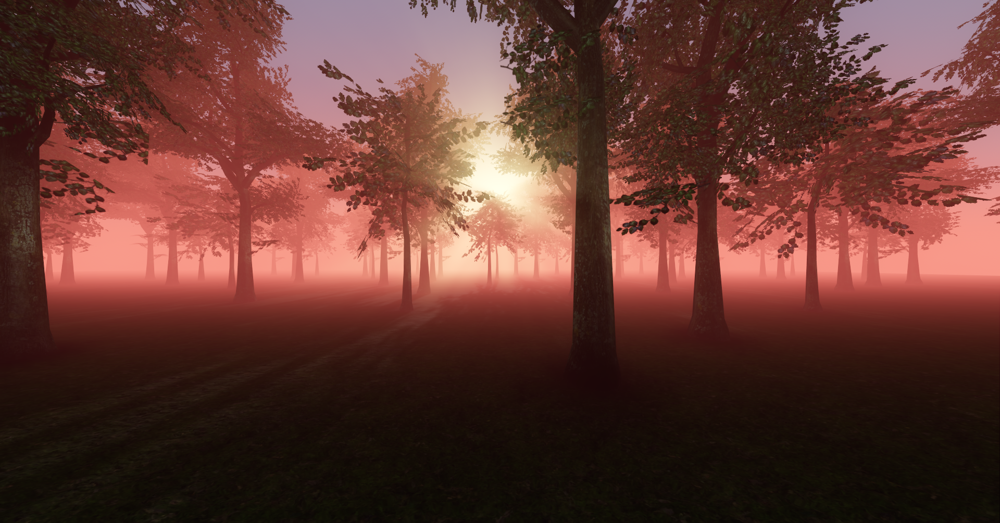

# Godot 4 volumetrics demo

Experimenting with Godot 4's new volumetrics system.

## Images

Old images (ordered from oldest to newest)

 

## Download

Exported to Windows, Linux (x86_64), and MacOS.

## Controls

- `Mouse`: look around
- `WASD`: movement
- `Shift`: run
- `F11`: toggle fullscreen

Mouse cursor gets hidden when the window is in focus.

## Development

Godot version: `4.0 stable`

If you wish to make changes, please [fork](https://github.com/Steveplays28/godot-volumetrics-test/fork) the repository and make a [pull request](https://github.com/Steveplays28/godot-volumetrics-test/compare).  
Feel free to open an issue as well.

## Attribution

- [*27 Vegetation 3d Assets* by L4M0S](https://l4m0s.itch.io/27-vegetation-3d-assets)
- [*SimpleGrassTextured* by IcterusGames](https://github.com/IcterusGames/SimpleGrassTextured)
- [*Footsteps Sounds* by Dryoma](https://dryoma.itch.io/footsteps-sounds)
- [*Butterfly - Looped Ambience Sounds Pack* by Diablo Luna ど苛ッ](https://pudretediablo.itch.io/butterfly)
